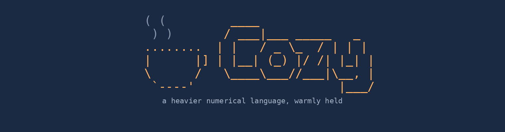

<p align="center">
  
</p>

**[Read the manual](MANUAL.md)** ([PDF](MANUAL.pdf)) — the full guide to the
language, REPL, and tools, with every example verified against the
interpreter. **[Try it in the browser](https://micomrkaic.github.io/cozy/)** —
the same interpreter, compiled to WebAssembly, with the books built in.

A **functional matrix language** with Octave-flavoured syntax, implemented in
C23 — the successor to [Neutrino](heritage/), built for numerical weight:
every Neutrino program is a valid Cozy program with the same meaning, enforced
by the inherited golden suite on every build. Cozy has a strict numeric tower
(now including **dual numbers** — exact forward-mode differentiation as a
value kind), **sparse matrices** with a legible promotion law, first-class
functions, immutable refcounted values, complex numbers, and a linear-algebra
core with **three interchangeable backends**: the zero-dependency hand-rolled
`tier0`, **OpenBLAS**, and **Accelerate** on macOS — the language is
byte-identical under all three (the conformance suite runs against each).
Pipelines come in three flavours: `|>` feeds the whole value, `~>` feeds each
element, `|>>` tees for debugging, and piping into a record literal fans out:
`data |> {n = length, mu = mean}`. An Emacs mode (`editors/cozy-mode.el`)
provides highlighting, indentation, and an inferior REPL.

```
cozy> let A = [2, 1; 1, 3]
[ 2  1
  1  3 ]
cozy> let x = A \ [5; 10]
[ 1
  3 ]
cozy> [1, 2, 3, 4] ~> (@ ^ 2) |> sum
30
cozy> dualeps(dual(3, 1) ^ 2)
6
cozy> [2.1, 3.7, 1.4] |> {n = length, mu = mean}
{n = 3, mu = 2.4}
```

That `6` is d/dx x² at 3, computed exactly by dual arithmetic — the gradient
engine behind `packages/optim.cz`, which does multivariate minimization and
maximization with box bounds and general equality/inequality constraints
(augmented Lagrangian over BFGS, all differentiated automatically).

## Status

Cozy is in **active development**, in usage-driven mode: the founding
capabilities — sparse matrices, external LAPACK, optimization, and
first-class differentiation — are shipped, and the roadmap is set by
friction in real use (CHARTER.md is the operating agreement; DESIGN_NOTES.md
is the docket of parked designs with written triggers). The engineering
constitution inherited from Neutrino — machine-verified documentation,
golden suites, sanitizers, the clean-room rite — is in force on every
release; its case law lives in LESSONS.md.

## Packages

Twelve standard packages, all written in Cozy itself (see PACKAGES.md;
worked problems in BOOK.md): **autodiff** (exact derivatives: `d(f)` and
`grad(f)` on dual numbers), **optim** (BFGS minimize/maximize, box bounds,
constrained via augmented Lagrangian), **sparselin** (conjugate gradient and
power iteration on sparse `S * v`), **dist** (probability distributions),
**poly** (polynomials, fitting, exact calculus), **finance** (TVM, bonds,
cash flows, dates), **astro** (sun, moon, and places), **rmt** (structured
random matrices), **phys** (CODATA constants), **scatter** (scatter plots),
**symb** (symbolic differentiation — expression trees as records), and
**demo** — the guided tour: load it and watch the greatest hits compute live.

## Build

Requires a C23-capable compiler (gcc 13+ / clang 16+) and `libm`.
GNU **readline** is optional but recommended — the Makefile auto-detects it
and falls back to a plain `fgets` REPL when absent.

```sh
make                       # ./cozy with the zero-dependency tier0 backend
make BACKEND=openblas      # LAPACK-backed kernels (needs libopenblas-dev)
make BACKEND=accelerate    # Apple Accelerate on macOS
make READLINE=0            # force the no-readline fallback
```

`buildinfo().backend` reports which backend a binary carries; measured on
`eig(rand(300))`: tier0 20.6 s, OpenBLAS 0.131 s, Accelerate 0.088 s — same
answers to the byte, per the conformance suite.

The build is `-std=c2x -Wall -Wextra -Werror -O2`. On gcc 14+, pass
`STD=c23`.

**macOS.** `cc` is Apple Clang; Xcode 15+ Command Line Tools provide the C23
features used here. The default `STD=c2x` is what to use. Readline: macOS's
`-lreadline` resolves to Apple's **libedit** shim (works; fewer signal
helpers) — for the full experience `brew install readline`; the Makefile
adds `$(brew --prefix)/{include,lib}` automatically. If Apple Clang's warning
set flags something gcc didn't, build with `make WERROR=` for that build.

**WebAssembly.** `make wasm` with a modern emsdk builds the single-file
browser bundle (`docs/cozy.js`, books and packages embedded);
`make wasm-ubuntu` carries the shims for stock Ubuntu's emscripten (the full
recipe is in PLAYBOOK.md).

## Testing

```sh
make test        # goldens + verified transcripts + doc lattice; the verdict is the exit code
make test-asan   # the same corpus under ASan/UBSan; fails on any leak
```

The suite is the language's definition: 1046 golden cases, three codegen
disassembly goldens, and every REPL transcript in MANUAL.md, PACKAGES.md,
and BOOK.md re-executed and diffed — plus structural lints on every table,
generated artifacts checked against their generators, and the whole corpus
leak-checked including error paths. Each golden is an input line and its
expected output:

```
sin(1:10) .^ 2 + cos(1:10) .^ 2
=> [1, 1, 1, 1, 1, 1, 1, 1, 1, 1]
gamma(2 + 3i)
=> !expected a real number      # => !substr asserts a raised error
```

## Run

```
cozy                 # interactive REPL
cozy script.cz       # run a file
cozy --sample        # the built-in demo
cozy --dis file.cz   # disassemble each statement's compiled chunk
cozy --ast file.cz   # dump the AST; --tokens for the token stream
```

In the REPL: **Ctrl-D** exits, **Ctrl-C** cancels the current entry, **Tab**
completes keywords and defined names; unbalanced brackets continue on a
`...>` prompt; history persists in `~/.cozy_history`. `help` prints the
grouped catalogue of all 171 builtins, `help(f)` describes one, `who` lists
your variables. A line beginning with `!` runs a shell command with session
state intact.

## Heritage

Cozy is built on the Neutrino project's engineering constitution:
PLAYBOOK.md (principles with their scars), LESSONS.md (every catch with its
mechanism), KNOWN_LIMITATIONS.md (honest debts), and CHARTER.md (this
project's founding agreement). The methodology is the product; this language
is its second application.
